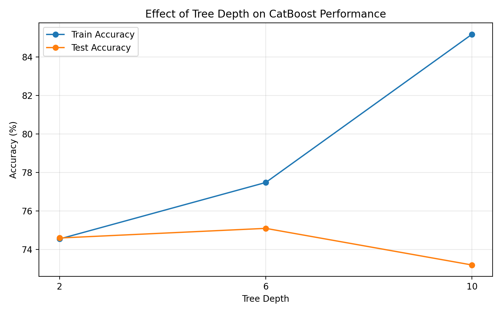
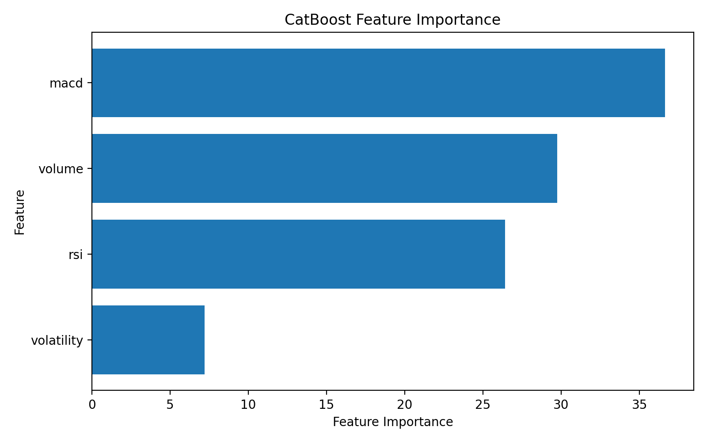

# CatBoost Binary Classification Demo

一个用于学习和验证 CatBoost 结构化数据建模流程的小型 Demo。

项目使用模拟的金融特征数据完成二分类任务，主要覆盖数据集划分、CatBoost 模型训练、Early Stopping、模型效果评估、树深度对比以及特征重要性分析。

> 说明：本项目使用模拟数据，主要用于验证 CatBoost 建模和分析流程，不代表真实金融预测效果。

---

## 1. 项目内容

当前 Demo 主要完成以下内容：

- 使用 Pandas 构造结构化特征数据
- 使用 CatBoostClassifier 建立二分类模型
- 划分 Train / Validation / Test 数据集
- 使用 Early Stopping 控制训练轮数
- 对 Train / Validation / Test 分别进行模型评价
- 对不同 `depth` 下的模型表现进行对比
- 分析模型过拟合现象
- 使用 CatBoost Feature Importance 分析特征重要性
- 保存模型指标及特征重要性分析结果

---

## 2. 数据说明

当前实验使用 5000 条模拟结构化数据。

输入特征包括：

| Feature | Description |
|---|---|
| `rsi` | 模拟 RSI 指标 |
| `volume` | 模拟成交量指标 |
| `macd` | 模拟 MACD 指标 |
| `volatility` | 模拟波动率指标 |

目标字段：

```text
target
```

其中：

```text
0 = 类别 0
1 = 类别 1
```

数据中的目标值由预设隐藏规则和随机噪声共同生成。

该规则仅用于生成模拟数据，CatBoost 训练过程中不会直接获得该规则，而是通过特征与历史标签自行学习预测关系。

---

## 3. 数据集划分

5000 条数据最终划分为：

```text
Total:       5000

Train:       3200
Validation:   800
Test:        1000
```

三部分数据用途分别为：

```text
Train
  ↓
模型训练

Validation
  ↓
Early Stopping
模型选择

Test
  ↓
最终泛化效果评价
```

---

## 4. CatBoost 模型

主要参数：

```python
CatBoostClassifier(
    iterations=2000,
    depth=6,
    learning_rate=0.05,
    loss_function="Logloss",
    eval_metric="Accuracy",
    random_seed=42
)
```

训练过程中使用 Validation Set 进行 Early Stopping：

```python
model.fit(
    X_train,
    y_train,
    eval_set=(X_val, y_val),
    early_stopping_rounds=50,
    use_best_model=True
)
```

虽然最大 `iterations` 设置为 2000，但模型会根据 Validation Set 的表现提前停止训练，并保留验证集表现较好的迭代结果。

---

## 5. 模型结果

当前实验的一次运行结果：

| Dataset | Accuracy |
|---|---:|
| Train | 73.41% |
| Validation | 75.12% |
| Test | 74.20% |

本次训练中：

```text
Best Iteration = 9
```

CatBoost 在验证集指标连续若干轮没有进一步改善后触发 Early Stopping，并根据 `use_best_model=True` 保留最佳迭代对应的模型。

> 由于本项目使用随机生成的模拟数据，这些 Accuracy 数值本身不代表真实金融预测能力，重点是验证完整建模和评价流程。

---

## 6. Tree Depth 对比实验

为了观察模型复杂度对泛化能力的影响，对 `depth=2 / 6 / 10` 进行了简单对比。

| Depth | Train Accuracy | Test Accuracy |
|---:|---:|---:|
| 2 | 74.55% | 74.60% |
| 6 | 77.48% | 75.10% |
| 10 | 85.17% | 73.20% |

实验中可以观察到：

```text
Depth
2 → 6 → 10

Train Accuracy
74.55% → 77.48% → 85.17%

Test Accuracy
74.60% → 75.10% → 73.20%
```
### 实验结果



随着树深度增加，训练集 Accuracy 持续提高。

但当 `depth=10` 时，Train Accuracy 上升至 85.17%，Test Accuracy 反而下降至 73.20%，Train/Test 差距明显扩大。

这说明继续增加模型复杂度虽然提高了训练集拟合能力，但没有带来更好的测试集表现，出现了明显的过拟合倾向。

实验结果见：

```text
results/depth_comparison.png
```

---

## 7. Feature Importance

使用 CatBoost 自带的 Feature Importance 对模型进行分析。

当前实验结果：

| Rank | Feature | Importance |
|---:|---|---:|
| 1 | MACD | 36.64 |
| 2 | Volume | 29.74 |
| 3 | RSI | 26.42 |
| 4 | Volatility | 7.20 |

### 特征重要性结果



结果表明，在当前模拟数据及当前模型中，`macd` 对模型预测的总体贡献较高，其次为 `volume` 和 `rsi`。

需要注意：

**Feature Importance 表示特征对当前模型预测的重要程度，并不能直接解释为现实中的因果关系。**

例如：

```text
MACD Importance 较高
```

不能直接得出：

```text
MACD 导致目标上涨或下跌
```

Feature Importance 主要用于回答：

> 当前模型总体上更依赖哪些特征进行预测？

---

## 8. 项目结构

```text
catboost_demo/
│
├── main.py
│   └── CatBoost 主训练及分析程序
│
├── plot_results.py
│   └── depth 参数实验结果绘图
│
├── requirements.txt
│   └── Python 依赖
│
├── README.md
│
└── results/
    ├── depth_comparison.png
    ├── feature_importance.png
    ├── feature_importance.csv
    └── model_metrics.csv
```

---

## 9. 环境

主要使用：

```text
Python
CatBoost
Pandas
NumPy
Scikit-learn
Matplotlib
```

安装依赖：

```bash
pip install -r requirements.txt
```

运行：

```bash
python main.py
```

运行完成后，模型评价指标及 Feature Importance 等结果会输出至：

```text
results/
```

---

## 10. 当前进展

目前已完成：

```text
CatBoost 二分类
        ↓
Train / Validation / Test
        ↓
Model Training
        ↓
Early Stopping
        ↓
Model Evaluation
        ↓
Depth Comparison
        ↓
Overfitting Analysis
        ↓
Feature Importance
```

后续计划继续补充：

- Precision / Recall / F1 等分类指标
- SHAP 全局及局部模型解释
- Feature Interaction Analysis
- 多分类 CatBoost
- CatBoost Regression
- SQL Server 数据读取及数据处理
- 面向时间序列数据的按时间划分与数据泄漏检查

---

## 11. 说明

本项目主要用于 CatBoost 结构化数据建模流程的学习和实验。

目前数据为模拟数据，因此项目重点不是追求某个 Accuracy 数值，而是完成并理解从：

```text
数据准备
→ 数据集划分
→ 模型训练
→ Validation
→ Early Stopping
→ 模型评价
→ 参数实验
→ 过拟合分析
→ 特征重要性分析
```

这一完整流程。

在真实金融历史数据场景中，还需要进一步考虑时间顺序划分、特征可用时间、未来信息泄漏、类别不平衡、评价指标选择以及模型稳定性等问题。
